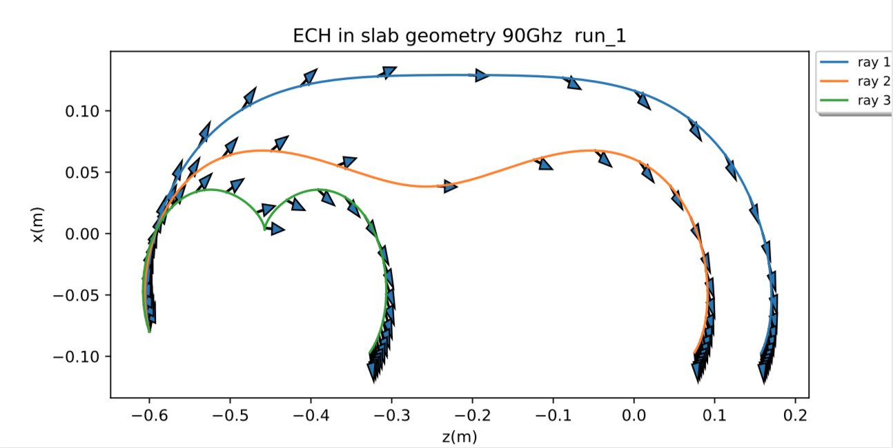
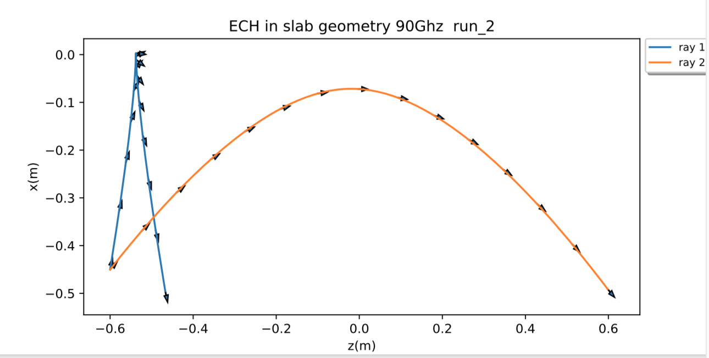
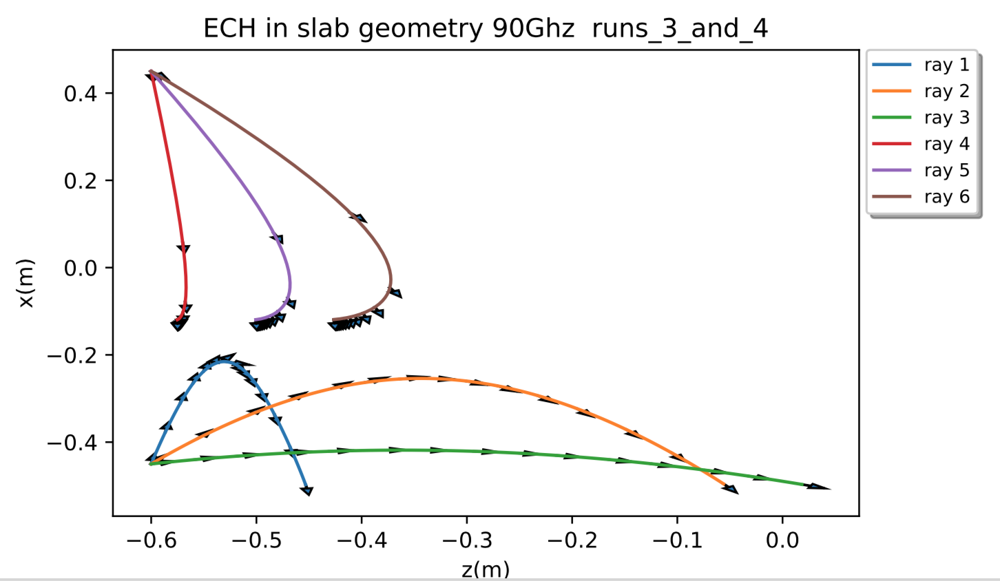

# Examples for ECH in simple slab geometry with cold plasma dispersion relation

These examples replicate the figures shown in \"Ray Tracing Near the Electron
Cyclotron Frequency with Application to EBT\" by
D.B.BATCHELOR,R.C.GOLDFINGER,AND H.WEITZNER, IEEE TRANSACTIONS ON PLASMA SCIENCE,
VOL. PS-8, NO. 2, JUNE 1980

The plasma is stratified in x and uniform in y and z.

Cases 1 and 2 are for constant magnetic field and increasing density, with the plasma cutoff
located at x = 0.

Case 1 is extraordinary mode launched above the lower hybrid resonance. rays
with nz = 0.4, 0.5, 0.6.  The interesting behaviour of the three rays is explained in
the reference mentioned above.

Case 2 is ordinary mode launched below the plasma cutoff with nz = 0.2, 0.6.  Again an
explanation is given in the IEEE paper.

Cases 3 and 4 are for constant density and linearly increasing Bz.  The cyclotron resonance
is at x = 0.  nz = 0.1, 0.4, 0.7.  Case 3 is extraordinary mode launched below the right hand
cutoff for all rays.  Case 4 is extraordinary mode launched above the cyclotron resonance.
The rays propagate freely through the fundamental resonance and travel down to the upper hybrid
resonance independent of nz.

