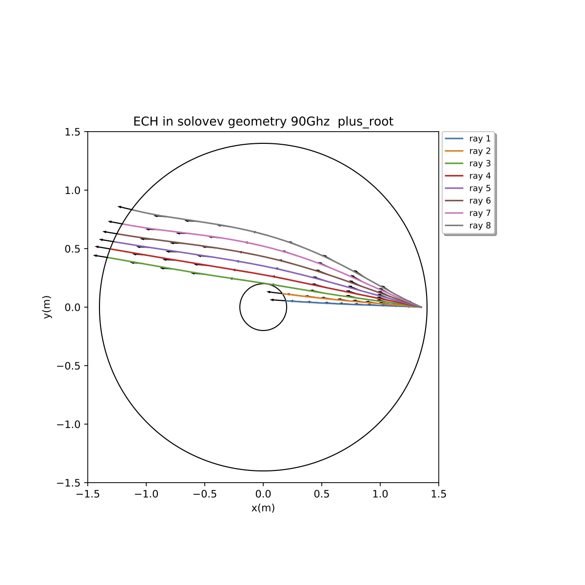
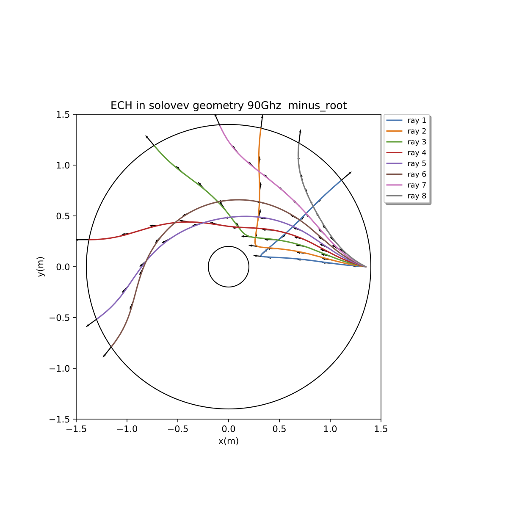
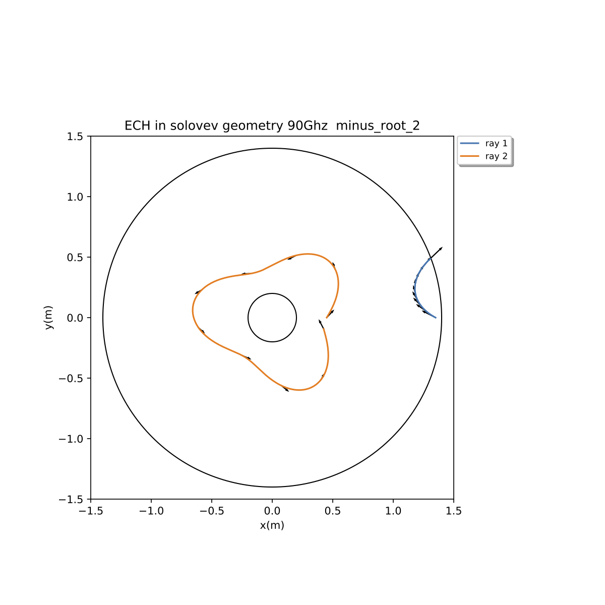

# Examples for ECH in Solovev toroidal equilibrium with cold plasma dispersion relation

These examples are for 90GHz eCH waves in a simple Solovev magnetic field (R0 = 1m, B0 = 1T).
The poloidal field is taken very small so that the rays lay in the Z = 0 equatorial plane.
For this situation the trajectories can largely understood from plots of the dispersion roots in
slab geometry.  The file kx_plots_Solovev_90GHz_ECH.pdf shows such roots. 

Case 1 is for (n0 = 0.5 x 10^20 m^-3) with n_phi = (0.05, 0.1, 0.15, 0.2, 0.25, 0.3, 
0.35, 0.4)

The plus root is ordinary mode, minus is extraordinary mode

The RF frequency is well above the plasma frequency to the ordinary mode (plus root) passes 
through with little bending.

The extraordinary mode is much more interesting.  To get some idea of what is going on check
out the plot for Case 1 in the pdf file.

Case 2 shows extraordinary mode launched from two locations.
At higher density n0 = 0.9 x 10^20 m^-3 and n_phi = 0.4 Ray 1, launched from the 
outside plasma edge encounters the right-hand cutoff and reflects back out.  Ray 2 is
launched from inside the plasma in a region where propagation in radially bounded.  The 
plot for Case 2 in the pdf file demonstrates this.  In ionospheric wave propagation this 
id commonly called a ducted wave.

Included are the input files needed to reproduce these cases.

