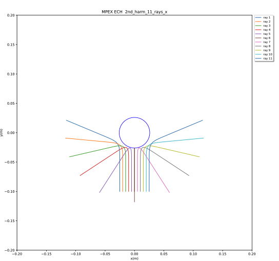

# MPEX 2nd harmonic ECH
## Case -> 11 Rays varying X launch position

Launch angle is 35.3 deg from vertical in the Y-Z plane and vertical in the X-Y plane.

Launch position and angles are specified in file *ray_init_2nd_harm_11_rays_x.in*.

RAYS input namelist file is: *MPX_70GHz_D3-6_2nd_harm_11_rays_x.in*

The magnetic field model is specified in netCDF file:
 *Brz_fields.MPEX_9_filaments_D3-6_ECH_2nd_harm.nc*

The magnetic field model is drived from the 26 coil set as described in spread sheet
provided by E. Burkhart. Each coil is modeled as a 3x3 array of current loops within the
radial and axial extent of the coils listed in the spread sheet.  The current in each
coil is as specified in the spread sheet for case D3-6.

